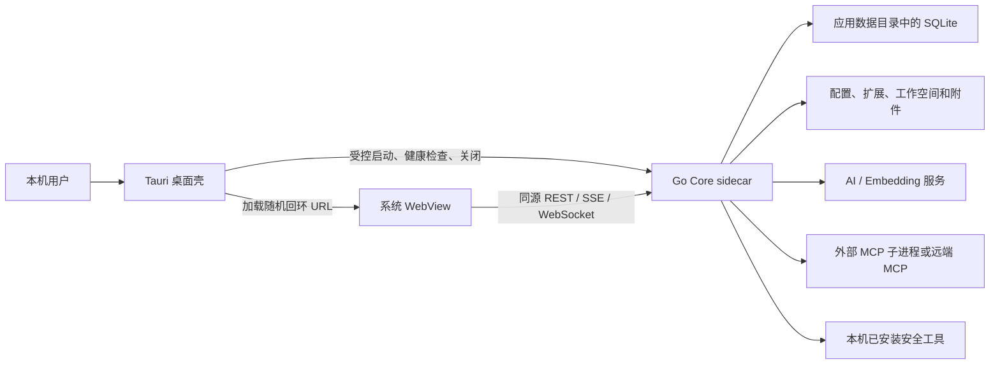
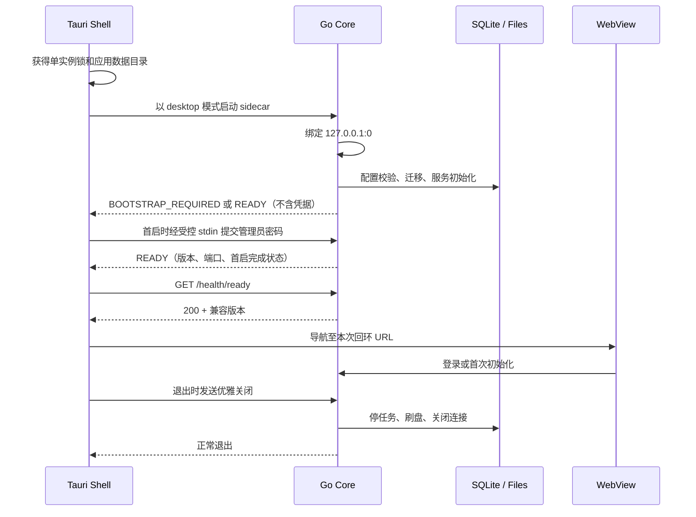

# CyberStrikeAI 桌面客户端二次开发计划

> 状态：**执行中；D0、D1、D2、D3 已完成，D4 已启动**
> 计划版本：1.3
> 规划日期：2026-07-31
> 开发分支：`codex/desktop-client`
> 基线：`main@5d1f5d28868f1935ece32d8d5fd538576d82aa3e`

## 1. 已确认的产品决策

以下决策已经冻结，后续实现不得自行缩小范围：

1. 桌面端只采用本地一体化运行方式，远程实例连接不属于桌面客户端目标范围。
2. 首批正式支持 Windows 和 macOS。
3. 桌面版核心功能以第 5 节的纳入矩阵为准。本地 Terminal、WebShell、C2、机器人接入、多用户 RBAC 和远程服务模式明确排除，不作为后续桌面版阶段保留。
4. 首个正式版本以复用现有 UI、Go 后端、HTTP API、SSE 和 WebSocket 行为为主，不进行 React/Vue 重写。
5. 产品按两个可独立验收和发布的阶段交付：R1 核心工作台，R2 本地插件联动。
6. R1 包含登录/初始化、AI 通道、对话与 Agent、工具/MCP、Skills、Agent 角色、工作流、知识库、任务、项目、资产、漏洞、监控和审计。
7. R2 在 R1 基础上增加 API 文档与浏览器/Burp 插件对本地桌面实例的受认证联动。
8. 规划、审查和用户确认是编码前置门禁；用户已于 2026-07-31 回复“按计划开始”，D0/D1 可以执行。

## 2. 目标与成功标准

### 2.1 产品目标

交付一个可安装、可升级、可卸载的 CyberStrikeAI 桌面应用。用户不需要手动启动 Web 服务或寻找浏览器地址，即可在桌面窗口中使用当前项目的核心能力；业务数据、用户配置和自定义扩展在应用升级后仍然保留。

### 2.2 目标平台支持矩阵

| 平台 | 架构 | 最低目标 | 发布物 | 支持级别 |
| --- | --- | --- | --- | --- |
| Windows | x86_64 | Windows 10/11，WebView2 Evergreen | 已签名安装包 | 一级支持 |
| macOS | arm64 | macOS 12+ | 已签名并公证的 DMG/app | 一级支持 |
| macOS | x86_64 | macOS 12+ | 已签名并公证的 DMG/app | 一级支持 |
| Windows | arm64 | 不纳入首个正式版本 | 无 | 后续评估 |
| Linux | 任意 | 不纳入首批范围 | 无 | 后续评估 |

### 2.3 可验证成功标准

每一个发布阶段都必须满足：可安装/升级/卸载，不依赖仓库目录；管理服务仅绑定 `127.0.0.1` 随机端口；不绕过认证、授权、HITL 和审计；数据升级失败可恢复；关闭后无 sidecar 或该阶段子进程遗留；Windows 与 macOS 目标均有真实安装验收证据；现有 `cmd/server` 和 API 保持兼容。

| 发布里程碑 | 可交付结果 | 不纳入该阶段的边界 |
| --- | --- | --- |
| R1 核心工作台 | 首启与 AI 通道、对话/Agent/HITL、工具/MCP、Skills/Agent 角色、工作流、知识库、任务、项目、资产、漏洞、监控和审计通过黄金路径与失败路径验收 | Terminal、WebShell、C2、机器人、多用户管理和远程服务不属于任何桌面版本；插件联动延后到 R2 |
| R2 本地插件联动 | 在 R1 基础上，API 文档和浏览器/Burp 可对用户明确选择的本地实例进行受认证联动 | 不扩展为远程实例连接，不恢复已排除功能 |

## 3. 当前基线与桌面化约束

### 3.1 当前架构

当前项目是 Go 单体服务：

- `cmd/server/main.go` 负责配置加载、信号处理和服务启动。
- `internal/app/app.go` 组装 Gin、SQLite、Agent、MCP、知识库、机器人、C2 和全部 Handler。
- `web/templates/index.html` 与 `web/static/` 提供原生 HTML/CSS/JavaScript 管理界面。
- 前端通过 REST、SSE、EventSource 和 WebSocket 调用本地 Gin API。
- SQLite、配置、上传文件、工作空间、工具、角色、Skills 和 Agents 都依赖本地文件系统。

### 3.2 已证实的阻碍

| 约束 | 当前证据 | 桌面化影响 |
| --- | --- | --- |
| Web 文件依赖工作目录 | `router.Static("/static", "./web/static")`、`LoadHTMLGlob("web/templates/*")` | 从 Finder、Start Menu 启动时可能找不到页面 |
| 数据使用相对路径 | `data/conversations.db`、`data/knowledge.db`、工作流检查点等 | 数据位置随启动目录变化，无法可靠升级 |
| 主服务直接占用配置端口 | `RunWithContext` 自行 `ListenAndServe` | 无法安全使用端口 0 并把实际地址交给桌面壳 |
| 首次管理员密码输出到终端 | `AttachRBACStore` 后打印生成密码 | GUI 启动时用户看不到终端输出 |
| C2 模板从源码目录读取 | `internal/c2/payload_templates` | C2 已排除；desktop 不初始化该服务、不打包模板，CLI 路径保持现状 |
| SQLite 使用 `go-sqlite3` | CGO 驱动 | 必须在目标平台构建和测试，不应依赖单机交叉编译 |
| 第三方安全工具来自 PATH | YAML 只定义命令，不包含实际工具 | 安装桌面应用不等于安装 nmap/sqlmap 等工具 |
| 机器人与外部 MCP 有后台进程 | 多个 goroutine 与子进程生命周期 | Desktop 禁用机器人初始化；仅对纳入的外部 MCP 做退出、重启和睡眠恢复治理 |

## 4. 目标架构

### 4.1 框架决策

采用 **Tauri v2 稳定版桌面壳 + Go 核心 sidecar**：

- Tauri 只负责应用窗口、单实例、原生菜单/对话框、sidecar 生命周期、安装包、签名和更新入口。
- 现有 Go 代码继续拥有桌面范围内的业务逻辑、数据库、认证、Agent 和 MCP。为保持 `cmd/server` 兼容，共享代码中已有的排除模块不因桌面化而删除，但 desktop 配置画像不初始化、不注册 UI 入口且不打包其专用资源。
- Go 核心启动后绑定 `127.0.0.1:0`，将实际端口通过一次性结构化握手返回给父进程。
- Tauri WebView 加载 Go 核心提供的本地 URL；页面、API、SSE 与 WebSocket保持同源。
- 桌面壳不向前端暴露通用 Shell、文件系统或任意进程启动能力。

选择原因：

- Tauri v2 是稳定版本，原生支持把任意语言的可执行文件作为 sidecar 打包。
- WebView 可以加载 HTTP/HTTPS 外部 URL，适合当前必须保留的 Gin、SSE 和 WebSocket 协议面。
- 与 Electron 相比，不需要随应用分发完整 Chromium 和 Node.js。
- 与 Wails v3 相比，不依赖仍处于 Alpha 的框架版本；与 Wails v2 相比，不需要绕过其资源服务的 WebSocket和 Windows 流式响应限制。

实施时必须通过 Cargo/npm 锁文件固定精确版本，禁止在发布构建中使用浮动的 `latest`。

### 4.2 进程与信任边界



安全边界：

- Tauri 壳只允许启动打包内的 Go core，不提供任意命令参数通道给网页。
- Go core 仍执行全部用户认证、RBAC、HITL 与审计。
- 本地端口随机化只降低误发现概率，不代替认证。
- WebView 只允许导航到本次启动的回环源；外部链接交给系统浏览器。
- 新窗口、下载、文件选择和自定义协议都必须有显式允许规则。
- 桌面模式不创建任何非回环监听器；本地管理与业务 API 只使用 `127.0.0.1:0`。

### 4.3 启动时序



### 4.4 运行时目录

所有路径由桌面壳解析为绝对路径并传给 Go core，禁止依赖 `os.Getwd()`。

| 类型 | macOS | Windows | 内容 |
| --- | --- | --- | --- |
| 应用数据 | `~/Library/Application Support/CyberStrikeAI/` | `%LOCALAPPDATA%\CyberStrikeAI\` | 配置、数据库、附件、自定义扩展 |
| 缓存 | 系统 Cache 目录 | `%LOCALAPPDATA%\CyberStrikeAI\cache\` | 可重建缓存、下载更新 |
| 日志 | 应用数据下 `logs/` | 应用数据下 `logs\` | 脱敏日志、崩溃诊断 |
| 临时文件 | 系统应用临时目录 | 系统应用临时目录 | 原子迁移、导入暂存 |

应用数据目录内固定布局：

```text
CyberStrikeAI/
  config.yaml
  data/
    conversations.db
    knowledge.db
    workflow-checkpoints/
    conversation_artifacts/
    c2/
  chat_uploads/
  workspace/
  tools/
  roles/
  skills/
  agents/
  knowledge_base/
  logs/
  backups/
  resource-manifest.json
```

规则：

- 纳入范围的 Web 页面从 R1 起编译进 Go core；C2 Payload 等排除模块的专用资源不进入任何桌面发布物。
- 默认 tools/roles/skills/agents/knowledge_base/config 示例作为版本化资源随安装包发布。
- 第一次启动复制默认可编辑资源；升级使用带 SHA-256 的 manifest 合并：未改动的默认文件可升级，用户改动永不静默覆盖，冲突生成并列候选和可读报告。
- 配置和敏感数据使用当前用户最小文件权限；macOS 目标为目录 `0700`、文件 `0600`，Windows 使用当前用户 ACL。
- 卸载默认保留应用数据；用户明确选择“同时删除数据”时必须二次确认并展示备份提示。

## 5. 功能范围与阶段覆盖

桌面版只验收本节标为“纳入”的功能。R1 中的“角色”指 Agent 角色库，不是平台多用户 RBAC。桌面端仍使用本地单管理员登录、现有权限中间件、HITL 和审计，不实现“本地即免鉴权”。

| 功能域 | 现有页面/能力 | 发布阶段 | 工程阶段 | 验收要点 |
| --- | --- | --- | --- | --- |
| 桌面生命周期 | 新增 | R1 | D1-D3 | 单实例、启动、就绪、退出、崩溃恢复 |
| 登录与首启 | 登录页、改密 | R1 | D3-D4 | 本地管理员初始化、登录、退出、会话过期 |
| AI 通道 | 设置中的 AI/Embedding 配置 | R1 | D3-D4 | 凭据安全存储、连接测试、模型选择和错误诊断 |
| 仪表盘 | `dashboard` | R1 | D4 | 统计数据与跳转正确 |
| 对话与分组 | `chat` | R1 | D4 | 新建、流式、取消、历史、置顶、分组、附件 |
| 单/多 Agent | 对话中的四种模式 | R1 | D4 | eino_single、deep、plan_execute、supervisor |
| HITL | `hitl` | R1 | D4 | 待审批、通过、拒绝、改参、白名单、审计策略 |
| 工具与监控 | `mcp-monitor` | R1 | D4 | 工具执行、等待、取消、详情、通知 |
| 外部 MCP | `mcp-management` | R1 | D5 | stdio、HTTP/SSE、启停、失败恢复 |
| 工作流 | `workflows` | R1 | D5 | 编辑、校验、dry-run、执行、恢复、包导入导出 |
| 项目与事实图 | `projects` | R1 | D5 | 项目、事实、关系图、攻击链提升 |
| 资产与信息收集 | `asset-*`、`info-collect` | R1 | D5 | 导入、筛选、合并、绑定、FOFA 查询 |
| 漏洞管理 | `vulnerabilities` | R1 | D5 | CRUD、统计、导出、筛选与批量操作；机器人提醒随机器人接入排除 |
| 批量任务 | `tasks` | R1 | D5 | 队列、暂停、重跑、定时、单任务执行 |
| 知识库 | `knowledge-*` | R1 | D5 | CRUD、扫描、索引、检索、日志 |
| Agent 角色/Skills/Agents | 管理及监控页面 | R1 | D5 | 创建、修改、删除、文件包、绑定与统计 |
| 文件管理 | `chat-files` | R1 | D5 | 作为对话/知识库支撑能力，验收上传、下载、编辑、重命名、目录和导出 |
| 审计 | 审计页面与导出 | R1 | D5 | 查询、详情、导出、保留策略 |
| 设置 | `settings` | R1-R2 | D3-D8 | 只展示纳入范围的配置，可保存、热应用或明确提示重启 |
| API 文档 | `/api-docs` | R2 | D8 | 本地访问、认证和调用示例正确 |
| 浏览器/Burp 插件 | 现有插件 | R2 | D8 | 只连接用户明确选择的本地实例，认证和 CORS 不放宽到任意源 |
| 国际化与主题 | 中英文、深浅主题 | R1-R2 | D4-D8 | Windows/macOS WebView 一致 |

| 明确排除的功能 | 现有页面/入口 | 桌面版处置 |
| --- | --- | --- |
| 本地 Terminal | 设置中的终端 | 不适配，不展示，不验收 |
| WebShell | `webshell` | 不注册桌面导航与路由，不验收 |
| C2 | 六个 C2 页面 | 不初始化 C2 服务，不打包 Payload 模板，不注册桌面导航与路由 |
| 机器人接入 | 设置中的多平台配置 | 不初始化机器人服务，不展示配置 |
| 平台多用户 RBAC | `platform-rbac` | 不注册桌面导航与管理路由；保留单管理员登录与现有授权中间件 |
| 远程服务模式 | 新增 | 不设计、不预留桌面 UI，客户端始终托管本地 sidecar |

排除不等于删除共享 Go server 的现有代码；本计划不对服务端做破坏性裁剪。但 desktop 模式必须以明确能力清单不初始化、不注册、不展示排除功能，且发布物不包含其桌面专用资源。

## 6. 桌面专属功能需求

| 编号 | 需求 | 验证方式 |
| --- | --- | --- |
| DESK-001 | 同一用户会话只运行一个桌面壳实例 | 连续双击应用，第二次唤醒已有窗口且不新建 core |
| DESK-002 | core 仅绑定 IPv4 回环随机端口 | 启动后检查监听地址；多次启动端口可变化 |
| DESK-003 | 壳等待数据库迁移和路由就绪后才展示主页面 | 人为延迟初始化，窗口显示启动态且不白屏 |
| DESK-004 | core 启动失败显示可操作错误页 | 配置损坏、数据库不可写、端口失败均给出日志位置和重试/退出 |
| DESK-005 | core 异常退出时窗口进入断线页 | 强制终止 core，UI 不继续表现为可执行状态 |
| DESK-006 | 正常退出完成任务取消、子进程停止和 SQLite 关闭 | 退出后检查无遗留进程、WAL 可正常重开 |
| DESK-007 | 首启凭据不经日志、URL、命令行明文传递 | 日志、进程参数、浏览历史扫描无凭据 |
| DESK-008 | WebView 只允许本次 core 源和内部页面导航 | 测试任意 HTTP、file、javascript、新窗口导航被阻断或外部打开 |
| DESK-009 | 下载和文件选择使用用户确认的原生对话框 | 导入、导出、附件和报告下载覆盖 |
| DESK-010 | 菜单提供刷新、日志目录、数据目录、关于和安全退出 | Windows/macOS 人工验收 |
| DESK-011 | 窗口状态可恢复但不会恢复到屏幕外 | 双屏断开后重启验收 |
| DESK-012 | 系统睡眠/唤醒后 Agent 和 MCP 状态可恢复或明确报错 | 两个平台实际睡眠测试 |
| DESK-013 | 新版本升级前自动形成可恢复的数据备份点 | 升级失败回滚演练 |
| DESK-014 | 安装包不包含真实配置、数据库、凭据或本地日志 | 发布物内容扫描 |

## 7. 安全设计

### 7.1 默认策略

- 桌面生成的新配置使用 `server.host: 127.0.0.1`、随机端口、主站 HTTP；回环传输不启用自签 TLS，避免 WebView 证书异常。
- 新桌面实例使用 `mcp.allow_global_access: false`，外部 MCP 默认关闭；桌面配置画像强制不初始化 C2 和机器人。
- 写文件、执行命令和高风险工具继续遵守单管理员授权、HITL 和审计。
- 导入旧配置时忽略已排除的桌面功能开关，并在导入报告中明确列出；不因旧配置而启动对应服务。
- 禁止把“本地桌面应用”解释为可以跳过登录或给所有请求注入管理员身份。

### 7.2 凭据管理

- 首次启动时，core 若检测到没有 RBAC 用户，只输出不含秘密的 `BOOTSTRAP_REQUIRED` 状态并暂停业务路由就绪。
- Tauri 使用独立的内置 bootstrap 窗口采集管理员密码；该窗口只拥有一个窄能力，将密码写入 core 的受控 stdin。主业务 WebView 不拥有该能力。
- core 在内存中读取、校验并哈希密码后完成 RBAC 初始化，立即丢弃明文并输出不含秘密的 READY。密码不得进入 URL、命令行、环境变量、stdout/stderr 或持久日志。
- AI、Embedding、FOFA 及其他纳入范围的 API 密钥迁移到 macOS Keychain / Windows Credential Manager。
- `config.yaml` 只保存密钥引用；Go 配置层通过一个窄接口解析引用，CLI 模式仍兼容环境变量和现有明文配置。
- 明文旧配置迁移必须显式提示、可预览并在成功写入凭据库后再原子替换配置。
- 前端配置 API 继续返回脱敏值；空值表示“不修改现有密钥”，不得因保存其他设置而清空密钥。
- 日志、握手、崩溃报告、审计详情和更新元数据都执行敏感字段脱敏。

### 7.3 WebView 与本地端口

- 只允许 `127.0.0.1:<本次端口>`；不接受 `localhost` DNS 重绑定或非回环地址替代。
- 保留登录令牌和权限中间件；EventSource/WebSocket 的令牌传递要避免持久化到普通访问日志。
- CORS 只允许当前产品明确需要的浏览器扩展源与配置源，不增加通配符。
- CSP 禁止远程脚本和任意 frame；需要访问 AI/MCP 远端的请求均由 Go 后端发起。
- 禁用生产 DevTools、任意 IPC、通用 shell plugin 和不受限文件系统 capability。
- bootstrap 窗口关闭后销毁其 capability；主业务窗口不得调用 sidecar stdin 或桌面进程控制接口。

### 7.4 更新与供应链

- 发布物、更新清单和更新包都必须签名；macOS 完成 Hardened Runtime 与 notarization，Windows 安装包和核心可执行文件签名。
- Cargo、Go 和必要的 npm 依赖均提交锁文件；CI 使用版本固定的工具链。
- 生成 SBOM 和 SHA-256 清单；发布物扫描不得包含 `.env`、`config.yaml`、数据库、证书私钥或临时文件。
- 自动更新必须在签名基础设施就绪后启用；此前只提供“检查版本并打开下载页”。

## 8. 数据、资源与迁移设计

### 8.1 新安装

1. 创建应用数据目录和权限。
2. 从安装资源生成桌面安全默认配置。
3. 复制可编辑默认资源并写入 `resource-manifest.json`。
4. 初始化 SQLite；通过桌面首启流程设置管理员密码。
5. 引导配置 AI 通道；模型测试成功后进入主界面。

### 8.2 从现有 Web 实例导入

导入入口接收用户选择的旧实例目录，仅复制以下白名单内容：

- `config.yaml`
- `data/` 中已知数据库、WAL/SHM、检查点和业务子目录
- `chat_uploads/`
- `tools/`、`roles/`、`skills/`、`agents/`、`knowledge_base/`

流程：

1. 校验源目录和版本，拒绝符号链接逃逸、未知绝对路径和正在写入的数据库。
2. 提示用户停止旧实例；SQLite 使用一致性备份方式，而不是只复制主 `.db` 文件。
3. 将全部内容复制到应用数据目录下的暂存区。
4. 对配置做解析、路径重写和敏感字段迁移预检。
5. 对数据库副本执行幂等迁移与完整性检查。
6. 生成导入报告，用户确认后原子切换；失败则删除暂存副本，源目录不变。

### 8.3 升级与回滚

- 每次需要配置或数据库迁移的升级，先创建带版本、时间、校验和的备份点。
- 迁移必须幂等；启动中断后可以继续或回滚。
- 程序二进制回滚与数据回滚分开描述，数据库结构不兼容时必须恢复匹配备份。
- 资源升级冲突不阻止应用启动，但必须在设置页显示待处理报告。
- 至少保留最近两个成功备份点；清理前展示空间占用并遵循保留策略。

## 9. 实施阶段与门禁

### D0：基线固化与测试清单

工作项：

- 保存基线提交、Go/Rust/Node/WebView2/Xcode 工具链版本。
- 运行现有 Go 测试、前端 CJS 测试和 server 构建，记录基线失败，不把既有失败误归因到桌面化。
- 生成页面、路由、后台 worker、子进程和运行目录清单。
- 准备无真实凭据的测试配置、SQLite 样本、假 AI、假外部 MCP 和授权本地靶场。

完成门禁：基线报告可复现；所有后续验收项都有对应测试数据或明确的人工环境。

执行状态：已完成，证据见 [D0 基线报告](desktop-client-d0-baseline.md)。

### D1：桌面框架与协议技术验证

只做最小验证，不迁移业务逻辑：

- 固定 Tauri v2 精确版本并建立最小壳。
- 打包一个最小 Go sidecar，由 sidecar 绑定 `127.0.0.1:0` 并返回 READY 握手。
- WebView 加载本地 Gin 页面；验证普通 REST、模拟 SSE、EventSource 和 WebSocket。
- 验证单实例、外链拦截、下载、sidecar 崩溃、正常退出和强制退出。
- 在 Windows x86_64、macOS arm64、macOS x86_64 上构建并运行。

完成门禁：三种目标均通过协议和生命周期验证；任何一项失败都必须先形成 ADR，不能直接进入全量集成。若 Tauri 路线无法满足门禁，回退候选是 Electron + Go sidecar，且必须重新审查安全与包体成本。

执行状态：已完成。Windows x64、macOS arm64、macOS x64 的构建、协议、单实例与生命周期矩阵全部通过，证据见 [D1 技术验证报告](desktop-client-d1-poc.md)和 [GitHub Actions 运行记录](https://github.com/StAugustine/CyberStrikeAI/actions/runs/30654959205)。

### D2：Go core 可嵌入/可托管改造

工作项：

- 将 `cmd/server` 的配置、App 创建和运行逻辑拆为可复用入口，保持 CLI 行为不变。
- 为 `internal/app.App` 增加由调用方传入 `net.Listener` 的服务方法，返回可观测的就绪/退出错误。
- 让 desktop 关闭过程幂等，统一停止 HTTP、内部/外部 MCP、Agent 任务和数据库。
- 使用 `embed.FS` 提供纳入范围的 Web 模板和静态资源；不嵌入 C2 Payload 模板或其他排除模块的桌面专用资源。
- 增加 `/health/live` 与 `/health/ready`；健康接口不得泄露配置、版本之外的敏感信息。
- 为桌面握手定义带协议版本的最小 JSON schema；解析未知字段保持兼容。

完成门禁：`cmd/server` 回归通过；core 可以在测试中使用端口 0 启动、接受 SSE/WS、被取消并无资源泄漏。

执行状态：已完成。调用方 `net.Listener` 注入、`live/ready` 健康检查、CLI 信号关闭顺序、幂等资源关闭、精选嵌入 Web 资源、v1 握手 schema，以及 SSE/WS、内部/外部 MCP、Agent 与后台任务随 core 退出的门禁均已落实；Go 全量回归、竞态测试、静态检查和三平台 CI 全部通过，证据见 [D2 Go Core 可托管改造报告](desktop-client-d2-core-hosting.md)和 [GitHub Actions 运行记录](https://github.com/StAugustine/CyberStrikeAI/actions/runs/30657471951)。

### D3：路径、配置、首启和桌面壳集成

执行状态：已完成。桌面绝对路径、运行目录、资源 manifest 与冲突策略、首启密码通道、系统凭据库、AI 通道向导、正式 sidecar、启动恢复页、固定日志/数据目录入口、窗口状态、单实例和最小 capability 均已落实；全量 Go 回归、竞态测试、静态检查、本机原生 smoke，以及 Windows x64、macOS arm64、macOS x64 CI 全部通过，证据见 [D3 路径、首启与桌面壳集成报告](desktop-client-d3-shell-integration.md)和 [GitHub Actions 运行记录](https://github.com/StAugustine/CyberStrikeAI/actions/runs/30667174358)。

工作项：

- 实现绝对应用数据路径和运行目录创建；消除桌面模式的 CWD 依赖。
- 实现默认资源 manifest、首次复制和升级冲突策略。
- 实现 `BOOTSTRAP_REQUIRED` 状态、独立 bootstrap 窗口、受控 stdin 密码提交和 AI 通道向导。
- 接入系统凭据库；完成明文密钥兼容与迁移。
- 完成启动页、错误页、日志/数据目录入口、窗口状态和单实例行为。
- 配置严格导航、下载、新窗口、CSP 和 capability allowlist。

完成门禁：全新安装路径、损坏配置、不可写目录、数据库迁移失败、凭据库失败都有明确且可恢复的行为。

### D4：R1 核心交互兼容

执行状态：自动化范围基本完成，人工验收待完成。已完成本地管理员登录/退出/刷新校验、AI 通道安全配置及 401/429/500/流中断脱敏失败路径、对话分组 CRUD、受管目录附件上传/下载/Agent 引用、单 Agent 与 deep/plan_execute/supervisor 三种多 Agent、取消、HITL 拒绝恢复、真实工具执行、监控详情、通知已读，以及 core 重启后旧会话失效、分组/附件/对话数据保留的桌面黄金路径；仪表盘已移除并停止轮询排除模块，主题、国际化、安全 Markdown 和长流首事件实时送达已纳入门禁。仍需完成睡眠唤醒和 Windows/macOS WebView 人工一致性验收。

范围：登录/本地单管理员权限基础、AI 通道、仪表盘、对话、分组、附件、单/多 Agent、HITL、工具执行、监控、通知、设置、主题和国际化。本阶段使用现有鉴权/授权链，但不开发或验收多用户管理 UI。

重点验证：

- 长时间 SSE 流不会因 WebView 或壳生命周期被缓冲/截断。
- Agent 取消、HITL 中断恢复和进程退出不会留下运行态记录。
- 窗口刷新、睡眠唤醒和 core 重启时登录态与 UI 状态符合预期。
- Windows WebView2 与 macOS WKWebView 的 Markdown、图形和大列表行为一致。

完成门禁：核心对话黄金路径和全部失败路径自动化/人工验收通过。

### D5：R1 管理与扩展功能兼容

执行状态：进行中。能力边界前置门禁已完成；项目和项目事实图已通过创建、更新、事实关系、弃用/恢复、攻击链生成与事实提升、关联查询、core 重启持久化与删除的桌面黄金路径，资产管理另已覆盖导入去重、兼容资产合并、项目解绑/重绑、批量元数据、扫描关联、风险筛选与覆盖统计，漏洞管理另已覆盖筛选、聚合统计、分组导出、筛选批量删除与审计；FOFA、ZoomEye、Quake、Shodan 信息收集已覆盖桌面凭据库、真实后端代理请求、结果规范化、未配置提示、上游错误脱敏与 core 重启后复用。工作流已覆盖校验、dry-run、CRUD、角色绑定执行、运行详情与回放，以及包导出、校验、冲突另存、幂等导入、审计和 core 重启持久化；Agent 角色、Skills/包文件和 Markdown Agents 已覆盖受管目录 CRUD、角色工作流绑定、Markdown Agent 角色绑定、真实 Skill 工具加载、调用统计、core 重启持久化和清理，知识库已覆盖受管目录 CRUD、目录扫描、本地 embedding 自动索引与全量重建、语义检索、Agent 工具调用、检索日志及 core 重启持久化和清理；批量任务已覆盖子任务编辑、单任务执行后暂停、并发执行、运行中暂停与取消、定时配置、重启持久化及重跑；文件管理已覆盖受管目录、上传、重命名、编辑、检索和 ZIP 导出；外部 MCP 已通过官方 SDK 的 Streamable HTTP 真实服务覆盖连接失败诊断与配置修复，并以 stdio、Streamable HTTP 和 SSE 三种真实传输覆盖工具发现与 schema、Agent 调用、启停及 core 重启自动恢复，其中 stdio 另验证受控环境变量与 PATH、core 关闭及配置删除时子进程回收，SSE 另验证请求头持久化，并修复启停状态位不一致和多传输重启时工具缓存刷新递归读锁死锁；审计已覆盖保留策略元信息、筛选汇总、记录详情、资源可用性、404、脱敏 JSON/CSV 导出及 core 重启持久化。desktop 模式已从活动服务、HTTP 路由、Agent 工具、导航、设置、页面、仪表盘轮询和脚本加载中排除 Terminal、WebShell、C2、机器人（含其漏洞推送订阅）和平台多用户 RBAC，并在 R1 隐藏 R2 API 文档入口；共享 server 模式保持原行为。

范围：项目、事实图、资产、信息收集、漏洞、批量任务、知识库、工作流、Agent 角色、Skills、Agents、外部 MCP、文件管理和审计。

重点工作：

- 文件选择、上传、下载和导出切换为桌面安全路径语义。
- 外部 MCP 子进程继承受控环境变量和 PATH，并随 core 关闭。
- 工具诊断页区分“工具定义已安装”和“系统可执行文件可用”。
- Desktop 能力清单必须从路由、导航、设置和服务初始化中排除 Terminal、WebShell、C2、机器人、平台多用户 RBAC 和远程服务；R1 同时隐藏尚未验收的插件联动入口。

完成门禁：功能矩阵中 R1/D5 模块全部通过 CRUD、错误处理、重启持久化和权限测试；越界功能无可达导航或默认后台活动。

### D6：数据导入、备份、升级与恢复

工作项：

- 实现旧实例导入向导、预检、暂存、原子切换和报告。
- 实现版本升级前备份、资源合并、数据库迁移和失败恢复。
- 验证从至少两个受支持的旧版本数据升级；更老版本给出明确兼容边界。
- 测试磁盘空间不足、导入中断、WAL 未合并、文件冲突和凭据迁移失败。

完成门禁：源数据始终不变；失败路径可恢复；备份能在两个平台恢复为可登录、可查询状态。

### D7：R1 构建、签名、发布与验收

工作项：

- Windows 原生 runner 构建 x86_64 sidecar 和安装包；macOS runner 分别构建 arm64/x86_64 或经过验证的 Universal 发布物。
- 锁定 Go、Rust、Node 与 Tauri 工具链；完成图标、Bundle ID、版本同步、许可证和第三方声明。
- 配置 Windows 代码签名、macOS Developer ID、Hardened Runtime 和 notarization；生成 SBOM、SHA-256 和安装包内容扫描报告。
- 执行 R1 功能矩阵、安装、首启、升级、卸载与重装验收；确认排除功能不可用，R2 插件联动入口尚未展示。
- 在签名更新链路未准备好时禁用自动安装更新。

完成门禁：三个一级架构从干净 runner 产生可安装、可验签且无敏感数据的 R1 发布物；R1 没有未处置的阻断/高风险缺陷，发布负责人批准。未通过此门禁不进入 R2 实现。

### D8：R2 本地插件联动

范围：API 文档、浏览器插件和 Burp 插件对本地桌面实例的联动。

工作项：

- 仅向用户明确启用的插件集成暴露本地 endpoint，并继续使用现有登录/授权链。
- 随机管理端口的发现信息不得包含会话、管理员令牌或凭据；过期或实例重启后必须失效。
- 浏览器扩展使用平台原生消息通道，Burp 使用用户明确选择的发现文件或等价受控机制；CORS 不使用通配符。
- API 文档的地址、认证和示例与桌面实例一致，不展示排除功能的桌面调用示例。

完成门禁：浏览器/Burp 只能联动用户明确选择的当前本地实例；未登录、过期发现信息、错误源和被排除 API 均被拒绝且有审计证据。

### D9：R2 全量验收与完整版发布

工作项：

- 在 R1 升级路径上安装 R2，验证原数据、配置和凭据保留。
- 重跑 R1 全部回归，并对 API 文档、浏览器插件和 Burp 联动逐项签字。
- 对 28 个现有业务页面做范围处置审核：20 个纳入页面有验收证据，8 个排除页面（WebShell、平台 RBAC 和六个 C2 页面）在 desktop 模式不可达。
- 执行长会话、并发任务、大文件、大工具输出、睡眠唤醒和异常断电恢复测试。
- 执行桌面威胁模型复核和依赖/发布物安全扫描，确认不含 C2 Payload 模板等排除资源。
- 更新中英文用户文档、插件联动、故障排查、安全告知、数据目录与迁移指南。

完成门禁：所有一级平台通过；R1 无回归；范围纳入/排除矩阵与实际发布物一致；没有未处置的阻断/高风险缺陷；发布负责人明确批准。

## 10. 工作分解与依赖顺序

| ID | 工作包 | 依赖 | 主要产物 |
| --- | --- | --- | --- |
| W01 | 基线测试与功能清单 | 无 | 基线报告、测试数据 |
| W02 | Tauri/sidecar 技术验证 | W01 | PoC、ADR、目标平台结果 |
| W03 | App listener 与就绪协议 | W02 | 可托管 Go core |
| W04 | R1 Web 资源嵌入 | W03 | 不依赖 CWD 的页面资源加载 |
| W05 | 关闭与子进程治理 | W03 | 幂等 shutdown、泄漏测试 |
| W06 | Desktop 路径与配置画像 | W03 | 应用数据布局、安全默认配置 |
| W07 | 默认资源 manifest/升级 | W06 | 种子与冲突处理 |
| W08 | Tauri 正式壳集成 | W03、W05、W06 | 启动、窗口、错误、菜单 |
| W09 | 首启管理员与凭据库 | W06、W08 | 初始化向导、SecretResolver |
| W10 | R1 核心交互兼容 | W04、W08、W09 | D4 功能验收 |
| W11 | R1 管理/扩展功能兼容 | W07、W10 | D5 功能验收 |
| W12 | 数据导入与恢复 | W06、W07、W09 | 导入向导、备份恢复 |
| W13 | CI、安装包与签名 | W02、W08 | 三类正式发布物 |
| W14 | R1 回归与发布验收 | W10-W13 | R1 发布候选验收报告 |
| W15 | API 文档与浏览器/Burp 本地联动 | W11、W14 | 受认证的本地实例联动结果 |
| W16 | R2 全量回归与安全验收 | W15 | 完整桌面版发布候选验收报告 |

顺序原则：W14 的 R1 门禁通过后才进入 W15，W16 完成最终发布验收。W12/W13 可在依赖满足后并行。数据库、配置和路径工作不得在多个工作包中无协调地同时修改。

### 10.1 预期代码改动区域

下列是实施边界，不要求预先创建空抽象；实际文件名在 D1/D2 评审时固定：

| 区域 | 预期改动 | 不应发生的改动 |
| --- | --- | --- |
| `cmd/server/` | 提取可复用启动参数，保持现有 CLI 行为 | 不删除或改成只支持桌面 |
| 新的 Go desktop core 入口 | 解析桌面路径、stdin bootstrap、READY 状态 | 不复制 `internal/app` 业务逻辑 |
| `internal/app/` | listener 注入、ready、幂等 shutdown、健康路由 | 不重写 Handler/API |
| `internal/config/` | desktop 配置画像、绝对路径、密钥引用解析 | 不破坏现有 YAML/环境变量兼容 |
| 版本化资源包 | 嵌入纳入范围的 Web 模板/静态文件 | 不在运行时依赖仓库源码目录，不打包 C2 Payload 等排除资源 |
| 新的资源/迁移代码 | manifest、导入、备份、原子切换 | 不静默覆盖或删除用户文件 |
| `desktop/` | Tauri 壳、最小 bootstrap 页、窗口/sidecar 状态机 | 不迁移 Agent、数据库或工具业务到 Rust |
| `web/` | 只做必要的桌面状态、外链、文件交互适配 | 不在首版重写前端框架 |
| CI/发布配置 | 三目标构建、签名、公证、SBOM、敏感文件扫描 | 不在普通 PR 中访问发布私钥 |
| `docs/` | 安装、迁移、排错、安全、发布说明 | 不把未验证平台标为支持 |

## 11. 测试策略

### 11.1 自动化层级

- Go 单元测试：路径解析、资源 manifest、配置兼容、握手 schema、listener 注入、幂等关闭、密钥引用。
- Rust 单元测试：READY 解析、版本兼容、允许 URL、sidecar 状态机、错误映射。
- Go 集成测试：真实端口 0、REST、SSE、WebSocket、数据库迁移、core 退出。
- 前端测试：保留现有 CJS 测试，新增 API 错误、桌面启动态、下载/外链行为测试。
- 浏览器共享 E2E：针对 Gin 页面使用 Playwright 或等价工具，按 R1/R2 当期功能矩阵扩展；不把浏览器 E2E 当作原生壳验收的替代。
- 原生冒烟：每个发布阶段均在每个目标平台安装发布物，验证启动、窗口、下载、睡眠、退出、从上一阶段升级和签名。
- 能力边界测试：桌面模式下已排除页面、API、配置入口和后台服务均不可达，且发布物不包含 C2 Payload 等专用资源。

### 11.2 CI 矩阵

| 作业 | Windows x64 | macOS arm64 | macOS x64 |
| --- | --- | --- | --- |
| Go 单测 | 必须 | 必须 | 必须 |
| Rust/Tauri 测试 | 必须 | 必须 | 必须 |
| Sidecar 构建 | 必须 | 必须 | 必须 |
| 安装包构建 | 必须 | 必须 | 必须 |
| 安装/启动冒烟 | 必须 | 必须 | 必须 |
| 签名验证 | 发布分支 | 发布分支 | 发布分支 |
| 范围边界测试 | 必须 | 必须 | 必须 |

### 11.3 必测失败路径

- 配置 YAML 损坏、配置目录不可写、数据库不可写或被锁。
- sidecar 启动失败、READY 超时、协议版本不匹配、运行中崩溃。
- 模型 401/429/500、SSE 中断、Agent 取消、HITL 拒绝。
- 外部 MCP 可执行文件缺失、进程退出、远端断线、工具超时。
- 系统安全工具缺失、PATH 变化、输出过大、子进程树取消失败。
- 知识库索引失败、磁盘空间不足、导入或升级中断。
- 通过直接 URL 或旧书签访问排除页面/API，导入旧配置携带已排除开关。
- 插件发现信息过期、来源错误、未登录、实例重启换端口和 CORS 拒绝。
- Windows WebView2 缺失/损坏；macOS 应用未签名或公证失败。

## 12. 发布与运营要求

### 12.1 发布前外部依赖

以下 R1 事项不阻塞 D0-D6 开发，但必须在 D7 发布门禁前由项目所有者提供或确认：

- 正式产品名、Bundle Identifier、Windows Upgrade Code。
- Windows 代码签名证书及安全的 CI 签名方式。
- Apple Developer ID、Team ID 和 notarization 凭据。
- 正式应用图标、安装界面素材和版权信息。
- 更新元数据托管位置、下载域名和发布密钥管理方式。
- Windows x64、macOS arm64、macOS x64 的 CI runner 或测试设备。

R2 进入 D8 前另需浏览器扩展和 Burp 插件测试环境。

### 12.2 版本策略

- 桌面壳、Go core、数据库 schema、资源 manifest 和握手协议分别有版本，但由同一产品版本统一发布。
- 壳与 core 版本不兼容时拒绝进入 UI，并显示可恢复错误，不尝试“勉强运行”。
- 数据库迁移只向前执行；降级需要恢复匹配备份。
- 自动更新采用分阶段发布和失败撤回；高风险模块变更在发布说明中单列。

### 12.3 第三方工具边界

首个正式版本不把 100+ 第三方攻防工具、Python、Go 编译器或任意外部 MCP 运行时全部打进安装包。桌面应用提供：

- 清晰的依赖诊断和平台安装指导。
- 当前 PATH、版本和可执行状态检测。
- 工具不可用时的可读错误和替代建议。
- 可选的、经过签名和校验的后续工具包机制单独立项。

这保持与当前项目“工具定义随项目提供、实际工具由系统安装”的能力边界一致。

## 13. 编码准入清单（Definition of Ready）

只有以下各项全部成立，才允许开始 D0/D1 编码：

- [x] 用户确认本地一体化优先。
- [x] 用户确认 Windows + macOS 首批支持。
- [x] 用户明确排除 Terminal、WebShell、C2、机器人接入、多用户 RBAC 和远程服务模式。
- [x] 用户确认分阶段交付；收缩后定为 R1 核心工作台→R2 本地插件联动。
- [x] 已创建独立分支 `codex/desktop-client`。
- [x] 已完成初版计划和独立计划审查。
- [x] 用户明确确认本计划可以开始执行。
- [x] 对 Tauri v2 + Go sidecar 路线无新增反对意见。
- [x] 用户接受首发架构矩阵（Windows x64、macOS arm64/x64）。
- [x] 用户接受第三方安全工具不随主安装包全量内置。

以上四项已由用户回复“按计划开始”一并确认，编码门禁于 2026-07-31 解除。

## 14. 分阶段完成定义（Definition of Done）

每一阶段都必须满足通用 DoD：当期功能矩阵有验收证据；三个一级构建通过干净环境安装与启动；`cmd/server` 和 API 无回归；升级、备份恢复和卸载保留数据通过；无当期进程遗留；签名、公证、SBOM、校验和和敏感文件扫描通过；文档与当期能力一致；无未处置阻断或高风险缺陷。

| 阶段 | 额外 DoD |
| --- | --- |
| R1 | D4/D5 功能验收完成；数据导入可恢复；R2 插件联动入口未启用；六类排除功能在 desktop 模式不可达；安装包不含 C2 Payload 等排除资源 |
| R2 | R1 全量回归；API 文档和浏览器/Burp 本地联动完成；20 个纳入页面有验收证据，8 个排除页面不可达；范围矩阵与发布物一致 |

## 15. 需求追踪

| 用户要求 | 计划证据 |
| --- | --- |
| 创建新分支 | `codex/desktop-client` 已从指定 main 基线创建 |
| 参考当前 main 二次开发 | 第 3 节基线分析、D0 基线固化、CLI 兼容门禁 |
| 桌面客户端 | 第 4 节目标架构、D1-D3 桌面壳与生命周期 |
| 具备用户定义的核心功能 | 第 5 节纳入/排除矩阵、D4-D9、R2 完整版门禁 |
| Windows + macOS | 第 2.2 节支持矩阵、D1 技术门禁与 D7/D9 分阶段发布验收 |
| 排除 Terminal/WebShell/C2/机器人/多用户/远程模式 | 第 5 节排除矩阵、D5 能力清单和 D9 不可达验收 |
| 分阶段交付 | 第 2.3 节 R1/R2 边界、D7/D9 分阶段发布门禁 |
| 先计划、审查、完善 | 本文 + `desktop-client-plan-review.md` |
| 完整计划后再编码 | 第 13 节用户确认门禁 |

## 16. 参考资料

- 当前项目架构：[architecture.md](architecture.md)
- 当前安全模型：[security-model.md](security-model.md)
- 当前测试指南：[testing.md](testing.md)
- 当前发布流程：[release-process.md](release-process.md)
- Tauri sidecar 官方文档：<https://v2.tauri.app/develop/sidecar/>
- Tauri 分发官方文档：<https://v2.tauri.app/distribute/>
- Tauri `WebviewUrl::External` API：<https://docs.rs/tauri/latest/tauri/enum.WebviewUrl.html>
- Wails v2 AssetServer 能力矩阵：<https://wails.io/docs/v2.12.0/reference/options/>
- Wails v3 当前状态：<https://v3.wails.io/faq/>
